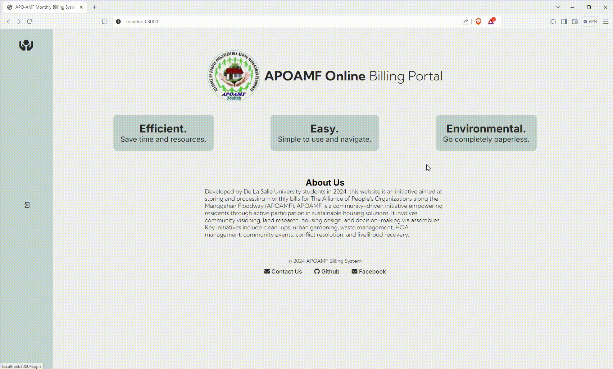

# monthly-billing

This project was created in collaboration with a group for a client that required a portable and efficient solution for managing monthly billing. It allows various roles to manage users, their billings, passwords, and provides tenants with an interface to view their bills and report issues.

## My Contributions
- Full stack development

## Collaborators
This project was developed in collaboration with:
- **Jack Clavano** - Frontend Developer
- **Germaine Ang** - Full Stack Developer
- **Casey Jalandoni** - Frontend Developer
- **Sean Cardeño** - Frontend Developer
- **Jeri Lei Concepcion** - Backend Developer
- **Jerimaya Flores** - QA

## Features

- **User Authentication**: Signup, login, logout
- **Role-Based Access**:
  - **Admin**: Manage users (CRUD operations), billings, passwords
  - **Finance**: Manage billings and passwords
  - **Floor Leaders & Building Leaders**: View and manage relevant user and billing information
  - **Tenants**: View bills, report issues to admin, change passwords

## Tech Stack

- **Frontend**: Handlebars, CSS
- **Backend**: Node.js
- **Database**: MongoDB

## Deployment

The application is deployed on Render and is reserved for the client.

## Project Setup

1. Clone the repository:
    ```bash
    git clone https://github.com/chizkuhhh/monthly-billing.git
    ```
2. Install dependencies:
    ```bash
    npm install
    ```
3. Set up environment variables:
    - Create a `.env` file in the root directory
    - Add the following environment variables:
      ```plaintext
      MONGODB_URI = your_mongodb_uri
      SERVER_PORT = 3000
      SESSION_SECRET = your_session_secret
      ```
4. Run the application:
    ```bash
    npm run dev
    ```
5. Access the application at `http://localhost:3000`

## Demo




## Contact
For any inquiries, feel free to reach out to:
- Simone Franceska Emanuelle M. Capio - simone\_franceska\_capio@dlsu.edu.ph
